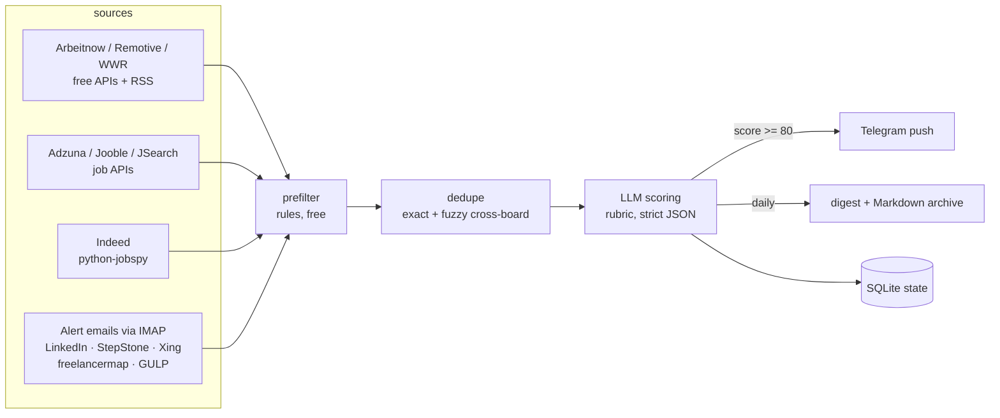

# jobradar

[](https://github.com/nicolacarkaxhija/jobradar/actions/workflows/ci.yml)

Config-driven job discovery — aggregate listings from APIs, RSS and the boards' own alert emails, score them against a personal rubric with a cheap LLM, and get pushed only what actually matters. Privacy-first: the engine is public, your search data never leaves your private repo.

Built because keyword alerts can't tell _Salesforce Commerce Cloud_ from _Salesforce everything-else_ — and no existing aggregator covers German boards, DACH freelance platforms and semantic filtering at once.

## How it works



- **Prefilter (free):** keyword rules kill obvious junk — no relevance signal, CRM-only listings, excluded seniorities.
- **Scoring (cheap):** a small model judges each survivor against a rubric — SFCC-vs-CRM semantics, geography × compensation trade-offs, seniority band — and returns strict, schema-validated JSON.
- **Email recycling:** boards without APIs (LinkedIn, StepStone, Xing, freelancermap, GULP) are ingested through their own alert emails from a dedicated inbox. An LLM extracts the listings, so board layout changes can't break a parser. No scraping, no ToS risk.
- **Delivery:** instant Telegram push for top scores, one daily digest, greppable Markdown archive.

Everything — signals, thresholds, sources, anchors — lives in [`config.yaml`](templates/data-repo/config.yaml). The engine knows nothing about SFCC; point the config at your own stack and it hunts for that instead.

## Two-repo setup

| Repo                    | Visibility | Contents                                              |
| ----------------------- | ---------- | ----------------------------------------------------- |
| `jobradar` (this)       | public     | the engine — config-driven, reusable                  |
| `jobradar-data` (yours) | private    | `config.yaml`, SQLite state, digests, GitHub Workflow |

The private repo's scheduled workflow installs the engine, polls every ~3h, commits state back, and sends the evening digest. Setup walkthrough: [docs/setup.md](docs/setup.md).

## Local development

```bash
pip install -e ".[dev,jobspy]"

ruff format src tests   # format
ruff check src tests    # lint
mypy src                # typecheck (strict)
pytest                  # test
```

Try it without any credentials — keyless sources only, in-memory DB, no notifications:

```bash
jobradar run --config templates/data-repo/config.yaml --dry-run --source arbeitnow --source remotive
```

Add `ANTHROPIC_API_KEY` to score, `--score-limit 5` to cap spend while testing.

Before trusting the rubric, check it against the built-in calibration suite — twelve
listings (a real SFCC role, a CRM mislabel, consultancy keyword soup, a tier-2
composable role, relocation with and without stated comp, a prompt-injection attempt…)
each with the score band it must land in:

```bash
jobradar calibrate --config config.yaml
```

It prints score, category and reasoning per case and exits non-zero if anything lands
out of band — a few cents per run, and a regression test for every future rubric edit.

## Design notes

- **Strictly typed.** mypy `--strict`, Pydantic models with `extra="forbid"` end to end — a typo'd config key or an unexpected API field fails loudly at load time, not silently at 4 a.m. in CI.
- **Sources are replaceable.** Each source is ~60 lines behind one interface; boards die, get bought, or close their APIs — losing one costs nothing.
- **Fails soft.** A broken source logs and skips; scoring degrades to collect-only when credentials are absent.
- **Costs ~€0–10/month.** Free API tiers + a few euros of LLM scoring at ~100 listings/day. Per-source daily quotas keep free tiers honest.

## Roadmap

- [x] v2: tailored application drafts (DE/EN matching the listing) for top matches — review-and-send, never auto-submit
- [x] Email digest channel behind the same notifier interface
- [x] Config-driven LLM web-search sweep ("what did the APIs miss this week?")
- [x] Application tracking: `jobradar track` + `TRACKING.md`, driveable from the Actions UI

## License

[MIT](LICENSE)
